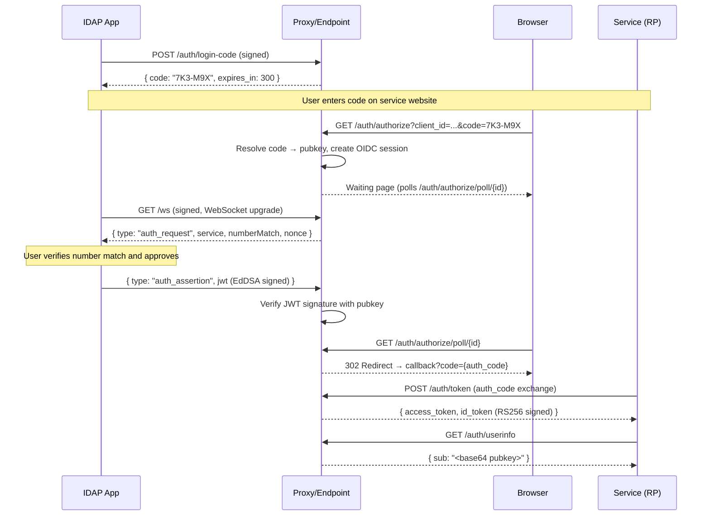
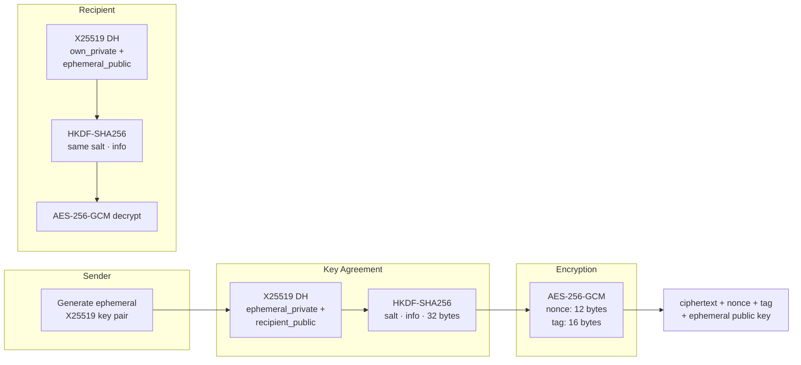
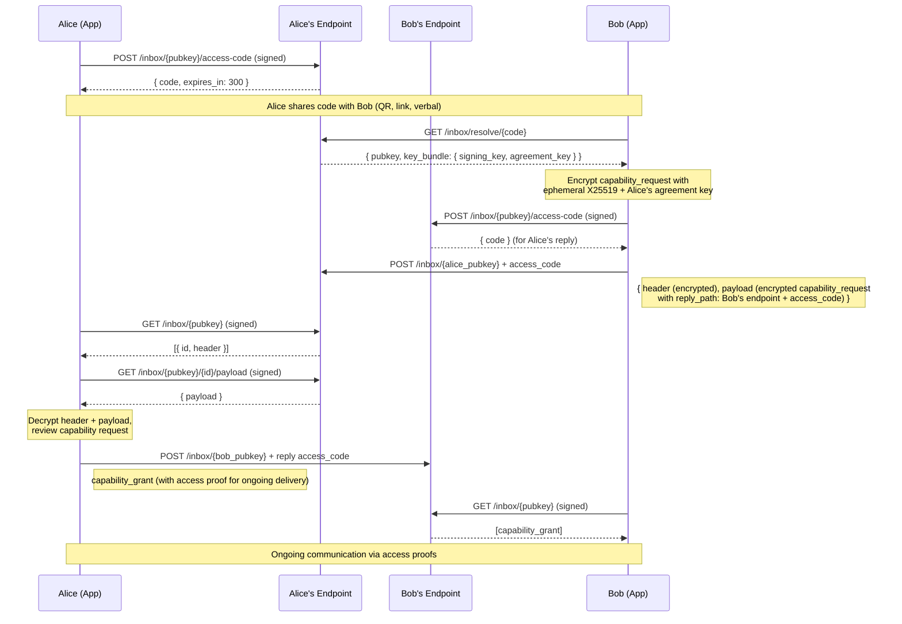

# IDAP Protocol Specification

*Version 0.2 — Draft*

---

## 1. Introduction

IDAP (Identity & Attestation Protocol) is an open protocol for key-based identity, authentication, attestation, and messaging.

A public key is an identity. The protocol defines how identities are discovered, how they authenticate to services, how claims about them are verified, and how they exchange messages. It does not define how keys are generated, stored, derived, or recovered — those are implementation concerns.

The protocol is algorithm-agnostic. It specifies a set of [supported signing algorithms](#2-signing-algorithms) and defines interfaces in terms of those algorithms, but does not mandate a specific choice. Implementations select an algorithm from the supported set.

This document describes the **wire protocol** — what any conforming implementation must do. It is deliberately language-agnostic. Implementation details belong in implementation documentation ([iOS reference](ios.md), [proxy reference](proxy.md)), not here. For the design philosophy behind these choices, see [Philosophy](philosophy.md).

The protocol defines:

- How identities are addressed and discovered
- How authentication works ([OIDC-compatible bridge](#5-authentication-oidc) for today's web, [direct key-based auth](#6-direct-key-based-authentication) for services that support it)
- How encrypted messages are access-controlled and delivered ([messaging](#7-messaging))
- How verifiable claims are made about identities ([verifiable log](#8-verifiable-log))
- Wire formats for all of the above

---

## 2. Signing Algorithms

The protocol supports a set of signing algorithms for identity keys. Implementations must support at least one. The current supported set:

| Algorithm | Key Size | Use |
|-----------|----------|-----|
| EdDSA (Ed25519) | 32 bytes | Signing and identity |

The supported set will grow over time as new algorithms are vetted. The protocol does not mandate a specific algorithm — it requires that implementations declare which they use and that verifiers support the declared algorithm.

In wire formats, the algorithm is identified by its JWA (JSON Web Algorithms) identifier — `EdDSA` for Ed25519. Key material is encoded as JWK (JSON Web Key) objects.

### 2.1 Key Agreement Algorithms

For establishing shared secrets (encrypted messaging, contact exchange), the protocol supports:

| Algorithm | Use |
|-----------|-----|
| X25519 | Diffie-Hellman key agreement |

Key agreement is used in messaging to encrypt payloads. The specific key agreement protocol (e.g., X3DH, simple DH) is an implementation choice — the protocol defines the [message envelope format](#7-messaging), not the key establishment method.

---

## 3. Core Concepts

### 3.1 Identity

An identity is a public key from a [supported signing algorithm](#2-signing-algorithms). The public key is the sole identifier — there are no usernames, handles, or human-readable addresses in the protocol.

The protocol does not define how keys are generated, derived, stored, or backed up. A key could come from a hardware token, a software derivation, a key management service, or any other source. The protocol cares only that the key exists and that its holder can produce valid signatures.

### 3.2 Addressing

An identity is a public key. The key exists independently of any endpoint, proxy, or infrastructure — it is generated and held on the user's device. Registration with an endpoint is optional and non-exclusive. A key may be registered at zero, one, or multiple endpoints simultaneously.

When sharing a key with others, the holder provides enough information for the other party to reach them. At minimum this includes the public key; it may also include one or more endpoint URLs where capabilities (inbox, OIDC, discovery) are available:

```
idap://connect?key=<base64url-encoded-pubkey>&endpoint=<endpoint-url>&code=<access-code>
```

The endpoint URL is not a permanent binding — it is where capabilities are *currently* available. A key can [migrate](#84-migration) between endpoints, register at additional endpoints, or operate without any endpoint at all (for direct key-based interactions).

In URL paths, the public key is **base64url-encoded** (RFC 4648, no padding). In HTTP headers and request/response bodies, **standard base64** is used. Implementations must convert between these two formats.

### 3.3 Proxies

A proxy is a server that provides key discovery, message routing, and [OIDC provider services](#5-authentication-oidc). It is a [pragmatic compromise](compromises.md) — an intermediary that exists because most devices don't have stable, publicly routable addresses today.

A proxy is a "dumb pipe." It routes messages and serves discovery information but cannot read anything it stores. All messages are encrypted client-side before reaching the proxy.

Anyone can run a proxy. The protocol does not require the use of a proxy — any infrastructure that provides [discovery](#4-key-discovery) and [message delivery](#7-messaging) satisfies the protocol's requirements.

A key is not bound to a single proxy. A user may register the same key at multiple proxies — using one for inbox, another for OIDC, and a third for discovery — or use no proxy at all. The OIDC provider and the inbox endpoint need not be the same server. [Per-key endpoints](#47-per-key-endpoints) formalize this: each capability can be hosted independently.

Proxy registration is an implementation convenience, not a protocol requirement. Conforming implementations should create identities locally on-device first, and treat pushing a key to a proxy as an optional step that enables network-reachable capabilities.

### 3.4 Federation

Endpoints discover each other through discovery documents. Given an identity's endpoint URL:

1. Fetch: `GET {endpoint_url}/.well-known/idap-configuration`
2. Extract capability URLs (keys, inbox, OIDC, etc.)
3. All subsequent calls go directly to those URLs

No central registry is needed. Identities share their endpoint URL alongside their public key.

---

## 4. Key Discovery

### 4.1 IDAP Configuration

Every endpoint must serve a discovery document:

```
GET /.well-known/idap-configuration

{
  "issuer": "https://endpoint.example.com",
  "protocol_version": "1",
  "supported_algorithms": ["EdDSA"],
  "key_endpoint": "https://endpoint.example.com/keys",
  "inbox_endpoint": "https://endpoint.example.com/inbox",
  "log_endpoint": "https://endpoint.example.com/log",
  "authorization_endpoint": "https://endpoint.example.com/auth/authorize",
  "jwks_uri": "https://endpoint.example.com/jwks"
}
```

The `authorization_endpoint` and `jwks_uri` fields are optional — only endpoints providing OIDC services include them.

### 4.2 OIDC Discovery

Endpoints acting as OIDC providers must also serve:

```
GET /.well-known/openid-configuration
```

This document follows the standard OpenID Connect Discovery specification.

### 4.3 Key Bundle

A key bundle contains the public identity information for a key:

| Field | Type | Purpose |
|-------|------|---------|
| `publicKey` | Signing key (e.g., Ed25519, 32 bytes) | Signing and identity |
| `algorithm` | String (JWA identifier) | Which signing algorithm this key uses |
| `endpoints` | Object (optional) | Per-capability endpoint URLs (see [4.7](#47-per-key-endpoints)) |

Key agreement material (pre-keys, one-time keys) is an implementation concern for the specific key agreement protocol used between parties. It is not part of the protocol-level key bundle.

### 4.4 Key Retrieval

```
GET /keys/{pubkey}

→ 200 OK
{
  "pubkey_bundle": "<base64-encoded key bundle>"
}
```

### 4.5 Key Registration

Registration is a proxy concern, not a protocol requirement. A proxy may accept key bundle uploads to know which keys it should route messages for:

```
PUT /keys/{pubkey}
Content-Type: application/json

{
  "pubkey_bundle": "<base64-encoded key bundle>"
}
```

For first registration, no authentication is required. For updates, the request must include [authentication headers](#91-request-authentication).

### 4.6 JWKS

The OIDC provider's signing key in JWK format, for JWT verification:

```
GET /jwks

→ 200 OK
{
  "keys": [
    {
      "kty": "RSA",
      "use": "sig",
      "alg": "RS256",
      "kid": "<key ID>",
      "n": "<base64url-encoded RSA modulus>",
      "e": "<base64url-encoded RSA exponent>"
    }
  ]
}
```

This is the OIDC provider's key, not the user's key. The provider [signs JWTs](#55-jwt-format) as the issuing authority. The user's public key is included as a claim in the token. This follows standard OIDC — one provider key, one JWKS endpoint.

The provider signing key algorithm is implementation-defined. RS256 (RSA + SHA-256) is recommended for maximum compatibility with standard OIDC client libraries (e.g., `go-oidc`, `node-openid-client`). The `idap_algorithm` claim in the JWT refers to the user's identity key algorithm (EdDSA), not the provider signing algorithm.

### 4.7 Per-Key Endpoints

A key's capabilities don't all have to live at the same endpoint. The key bundle can advertise per-capability URLs:

```json
{
  "publicKey": "<base64>",
  "algorithm": "EdDSA",
  "endpoints": {
    "inbox": "https://my-inbox.example.com/inbox",
    "log": "https://my-log.example.com/log",
    "oidc": "https://big-proxy.example.com/oidc"
  }
}
```

If `endpoints` is omitted, all capabilities are assumed to live at the endpoint where the key bundle was retrieved (the default for keys registered at a single proxy).

This is the normal configuration model, not an edge case. A casual user registers everything at one proxy. A self-hoster runs their own inbox but uses a shared OIDC provider. An organization hosts its own log but uses managed infrastructure for everything else. A privacy-conscious user spreads capabilities across unrelated providers to prevent any single operator from seeing the full picture.

The addressing scheme supports this directly — when sharing a key via `idap://connect`, the `endpoint` parameter points to where the key bundle can be retrieved. The key bundle then directs callers to per-capability URLs. The shared endpoint is a discovery entry point, not a permanent home for all capabilities.

---

## 5. Authentication (OIDC)

IDAP includes an OIDC-compatible authentication flow as a [pragmatic bridge](compromises.md#oidc-as-auth-bridge) — it lets IDAP identities work with any service that supports OpenID Connect today.

Authentication uses the same [access code infrastructure](#72-inbox-access) as messaging. The user generates a code in the app; the service uses that code to create an auth request. Services cannot cold-start auth requests — they need a code the user deliberately generated. This eliminates unsolicited auth requests and phishing.

### 5.1 Access Codes and Authentication

Login codes are a specific use of the general [access code](#72-inbox-access) mechanism. The same infrastructure generates, resolves, and validates codes for both authentication and messaging. The difference is how the code is used:

- **For messaging**: the sender resolves the code, fetches the key bundle, and delivers a [capability request](#74-capability-negotiation) directly to the inbox
- **For OIDC auth**: the user enters the code on a website, and the OIDC authorize endpoint translates it into an auth request delivered to the inbox

In both cases, the user generates a code, shares it with a third party, and reviews an incoming request. The OIDC endpoints are a web-friendly wrapper around the same flow — they exist because browsers don't speak IDAP natively.

```
POST /auth/login-code
X-IDAP-Key: <base64 public key>
X-IDAP-Signature: <signature>
X-IDAP-Timestamp: <unix timestamp>

→ 200 OK
{
  "code": "7K3M9X",
  "expires_in": 300
}
```

This endpoint MAY share implementation with the inbox access code endpoint. The code format, generation method, and expiration period are implementation choices.

### 5.2 Authorize Flow



The service (relying party) initiates authorization. The browser navigates to:

```
GET /auth/authorize?client_id=gamesite.com&redirect_uri=https://gamesite.com/callback&nonce=xyz&state=abc
```

This displays a login form where the user enters their code. On submission:

```
POST /auth/authorize

{
  "code": "7K3M9X",
  "client_id": "gamesite.com",
  "redirect_uri": "https://gamesite.com/callback",
  "nonce": "xyz",
  "state": "abc"
}
```

The endpoint:

1. Resolves the code to the user's public key (same resolution as [inbox code resolution](#72-inbox-access))
2. Generates a number-match challenge (a 2-digit number)
3. Creates an OIDC session
4. Delivers the auth request to the user's inbox
5. Returns a page showing the number-match and polling for approval

### 5.3 Auth Request Delivery

Auth requests are delivered to the user's inbox as messages, using the same [delivery mechanism](#75-delivery) as all other messages. The app retrieves them by checking the inbox — no separate delivery channel is required.

Implementations MAY provide additional delivery methods for lower latency during active login sessions:

**WebSocket.** The app opens a WebSocket connection when the user initiates a login, receiving auth requests immediately:

```
GET /ws
X-IDAP-Key: <base64 public key>
X-IDAP-Signature: <signature>
X-IDAP-Timestamp: <unix timestamp>

→ 101 Switching Protocols
```

This is an implementation-level optimization for responsiveness. The inbox is the canonical delivery path — the WebSocket endpoint is a convenience method that implementations may choose to provide.

Auth requests arrive as JSON:

```json
{
  "type": "auth_request",
  "requestId": "uuid",
  "service": "gamesite.com",
  "serviceDisplayName": "GameSite",
  "nonce": "xyz789",
  "expiresAt": 1740000030
}
```

The browser displays a number-match challenge. The user sees the number in both the browser and the app, confirms it matches, and approves. The app signs a JWT assertion (EdDSA over the request ID, service, and nonce) and submits it via the WebSocket. The endpoint verifies the JWT signature with the user's public key and completes the OIDC session.

### 5.4 Token Exchange

After the user approves, the service exchanges the authorization code for tokens:

```
POST /auth/token
Content-Type: application/x-www-form-urlencoded

grant_type=authorization_code&code={auth_code}&client_id={client_id}&redirect_uri={redirect_uri}

→ 200 OK
{
  "access_token": "<JWT>",
  "token_type": "Bearer",
  "id_token": "<JWT>"
}
```

### 5.5 JWT Format

The JWT is signed by the OIDC provider (the proxy or endpoint serving the auth flow), not by the user. This follows standard OIDC — the identity provider is the token authority. The user's public key is included as a claim.

**Header:**
```json
{
  "alg": "RS256",
  "typ": "JWT",
  "kid": "<provider key ID>"
}
```

**Payload:**
```json
{
  "iss": "https://proxy.example.com",
  "sub": "<base64 public key>",
  "aud": "gamesite.com",
  "nonce": "xyz789",
  "iat": 1740000000,
  "exp": 1740003600,
  "request_id": "uuid",
  "idap_pubkey": "<base64 public key>",
  "idap_algorithm": "EdDSA",
  "idap_inbox": "https://inbox.example.com/inbox"
}
```

The `sub` claim is the user's public key. The `idap_pubkey` and `idap_algorithm` claims allow services that want to interact with the user's key directly (e.g., for [direct key-based auth](#6-direct-key-based-authentication) or [messaging](#7-messaging)) to do so.

The JWT may include an `idap_inbox` claim indicating where the user's inbox is reachable:

```json
{
  "idap_inbox": "https://inbox.example.com/inbox"
}
```

This allows the service to discover the user's inbox endpoint without a separate discovery lookup — useful for [services that want to become contacts](#58-services-as-contacts). The `idap_inbox` value may differ from the `iss` — the OIDC provider and the inbox endpoint are independent.

Services verify the JWT against the provider's [JWKS endpoint](#46-jwks) — one key, standard OIDC verification. No per-user JWKS resolution needed.

### 5.6 Scopes

The protocol defines well-known scopes that services can request:

| Scope | Description |
|-------|-------------|
| `openid` | Standard OIDC. Returns `sub` (public key) |
| `pubkey` | Include `idap_pubkey` and `idap_algorithm` claims |
| `attestation:<claim>` | Require or request a specific attestation (e.g., `attestation:age_gte_18`) |
| `contact_card` | Request contact information (user chooses which fields to share) |

Services declare required and optional scopes in the authorize request. The user sees what's being requested and approves or denies. Attestation scopes trigger verification against the user's [verifiable log](#8-verifiable-log) or the relevant authority's log.

Applications may define additional scopes using reverse-domain notation (e.g., `com.example.game-level`).

### 5.7 Userinfo

```
GET /auth/userinfo
Authorization: Bearer <access_token>

→ 200 OK
{
  "sub": "<base64 public key>"
}
```

No PII is returned unless explicitly shared through [messaging](#7-messaging).

### 5.8 Services as Contacts

After authenticating with a service via OIDC, the service may request an ongoing relationship through the [capability negotiation](#74-capability-negotiation) system. This allows a service to become a contact — able to deliver messages to the user's inbox for receipts, notifications, or future authentication requests.

The service includes a `capability_request` as part of or following the OIDC flow:

```json
{
  "type": "capability_request",
  "identity": {
    "name": "GameSite",
    "type": "service",
    "client_id": "gamesite.com"
  },
  "requested_access": {
    "categories": ["transactional", "account"],
    "message_types": ["auth_request"]
  },
  "attestations": ["<reference to authority attesting gamesite.com>"]
}
```

If the user approves, the service receives an [access proof](#73-access-proofs) and can deliver messages to the user's inbox without a new code. Future authentication requests from the service flow through the inbox like any other message — the user approves in-app, and the endpoint issues a JWT.

The service discovers the user's inbox via the `idap_inbox` claim in the JWT (see [JWT Format](#55-jwt-format)). This works regardless of whether the OIDC provider and the inbox endpoint are the same server.

A service does not need its own IDAP public key to become a contact. It can be identified by its domain, `client_id`, or an attestation from a trusted authority. Services that do have IDAP keys get the full benefit of the protocol (verifiable identity, signed messages); services that don't can still participate through the capability system with their existing web identity.

This bridges the gap between one-shot OIDC authentication and an ongoing relationship — the same mechanism that connects two people also connects a person and a service.

---

## 6. Direct Key-Based Authentication

Services can accept IDAP key-based authentication without an OIDC provider. This is the simpler, more direct authentication method — no tokens, no redirect flows, no intermediary.

The minimal integration:

1. Store a table of authorized public keys
2. Issue nonces: `GET /idap-auth/challenge → { nonce, expires_at }`
3. Verify signatures: `POST /idap-auth/verify { pubkey, signature, nonce }`

The signature is over the nonce using the identity's signing key. The service verifies using the presented public key.

Access is granted via invite links:

```
idap://access?name=My+Service&endpoint=https://example.com/idap-auth&token=<invite_token>
```

The invite token is single-use and short-lived. After registration, the service authenticates via challenge-response using the registered public key.

As IDAP adoption grows and services implement direct key-based auth, the [OIDC bridge](#5-authentication-oidc) becomes less necessary. See [Pragmatic Compromises](compromises.md#oidc-as-auth-bridge).

---

## 7. Messaging

Messaging is asynchronous, encrypted delivery of data between identities. The protocol defines a two-part message format (header + payload), an access model for inbox delivery, capability negotiation between sender and recipient, and delivery semantics. It does not define what messages contain — that's up to applications.

### 7.1 Message Format

A message consists of two parts, both encrypted to the recipient's public key:

**Header** — lightweight metadata about the message, designed to be fetched and processed independently of the payload:

| Field | Description |
|-------|-------------|
| `sender` | Sender's public key (encrypted; allows recipient to identify sender after decryption) |
| `type` | Message type identifier (well-known or application-defined) |
| `payload_hash` | Hash of the decrypted payload (for verification after decryption) |
| `payload_size` | Size of the payload in bytes |
| `attestations` | Optional array of [log entry references](#8-verifiable-log) relevant to this message |
| `timestamp` | When the message was created |

**Payload** — the actual content, potentially large, fetched separately:

The payload is an opaque encrypted blob. Its structure depends on the message `type` declared in the header. The protocol defines [well-known message types](#77-well-known-message-types) for common operations; applications may define their own.

### 7.2 Inbox Access

Inbox delivery is access-controlled. A sender needs authorization from the inbox owner before delivering messages. This prevents unsolicited delivery and gives the inbox owner control over who can reach them.

Authorization is established through **access codes** — single-use, time-limited tokens generated by the inbox owner:

- **Single-use** — consumed on redemption
- **Time-limited** — expire after a defined period
- **Key-bound** — verifiable as generated by the inbox owner's key

The code format, generation method, and expiration period are implementation choices. The protocol requires only that the endpoint can validate a code and associate it with the inbox owner's key.

An access code grants delivery of exactly one message. The recommended use is a [capability request](#74-capability-negotiation) — a structured declaration of who the sender is and what they want. The inbox owner reviews the request and responds with a grant, partial grant, or denial.

#### Code as Discovery

An access code is bound to an inbox — a `(public_key, endpoint)` pair. A sender needs all three pieces (code, key, endpoint) to deliver a message. How these are shared is an implementation choice. Possibilities include:

- **Link or QR code** — encodes the code, public key, and endpoint in a single scannable or tappable artifact (e.g., `idap://connect?endpoint=...&code=...`)
- **Short code with known endpoint** — the sender already knows the endpoint (e.g., a well-known proxy); the short code alone is enough to look up the inbox owner's key
- **Short code spoken verbally** — the sender enters the code in their app, which resolves it against a configured or default endpoint

When a short code is presented without an endpoint, the sender's app resolves it:

```
GET /inbox/resolve/{code}

→ 200 OK
{
  "pubkey": "<base64 public key>",
  "key_bundle": { ... }
}
```

This lets the endpoint map a short code to the inbox owner's key bundle without the sender needing to know the public key in advance. The endpoint returns enough information for the sender to encrypt a message and deliver it.

#### Generating Access Codes

```
POST /inbox/{pubkey}/access-code
X-IDAP-Key: <base64 public key>
X-IDAP-Signature: <signature>
X-IDAP-Timestamp: <unix timestamp>

→ 200 OK
{
  "code": "<access code>",
  "expires_in": 300
}
```

Only the inbox owner can generate access codes for their inbox.

#### First-Message Encryption

A sender using an access code has no prior shared secret with the recipient. The first message is encrypted using ephemeral key agreement — the sender generates a one-time key pair, performs a key agreement with the recipient's public key, derives a symmetric key, and encrypts. The ephemeral public key is sent alongside the ciphertext so the recipient can derive the same symmetric key.



The specific key agreement protocol and symmetric cipher are implementation choices. The protocol requires only that the first message is encrypted to the recipient's public key and that the sender's identity is authenticated within the encrypted payload (e.g., by signing the plaintext with their own key before encryption).

### 7.3 Access Proofs

After an inbox owner grants a sender ongoing access (via a [capability grant](#74-capability-negotiation)), the grant includes an access proof — a credential the sender presents with subsequent deliveries.

The endpoint verifies the proof against the inbox owner's key and accepts or rejects the delivery. The proof mechanism is an implementation choice — possible approaches include signed access grants, rotating bearer tokens, or zero-knowledge proofs.

**Zero-knowledge proofs** are particularly well-suited: the sender proves membership in the set of authorized senders without revealing which authorized sender they are. This prevents the endpoint from correlating messages to specific senders or building a social graph from delivery metadata.

The protocol requires only that:

1. The proof is verifiable by the endpoint using the inbox owner's public key
2. The proof does not require the sender to reveal their identity to the endpoint
3. The endpoint can determine from the proof that the inbox owner authorized the delivery

### 7.4 Capability Negotiation

When a sender redeems an access code, the delivered message is typically a **capability request** — a declaration of who the sender is and what access they want. The inbox owner reviews and responds.

This negotiation applies equally to people, services, and systems. A friend requesting contact exchange, a business requesting permission to send receipts, and a marketing service requesting promotional access all use the same mechanism — the inbox owner's app presents the request and the owner decides.

#### The Handshake

Capability negotiation is a two-message handshake. Both parties are typically behind endpoints they don't control (proxies, hosted infrastructure), so the entire flow is asynchronous — each side delivers a message to the other's inbox and checks for a response later.



1. **Alice generates an access code** and shares it with Bob through any channel — showing a QR code, sending a link, reading it aloud
2. **Bob resolves the code** to find Alice's endpoint and key bundle, then sends a `capability_request` to Alice's inbox. The request includes a **reply path** — Bob's endpoint, public key, and a one-time reply token for his own inbox — so Alice can respond
3. **Alice retrieves the request**, reviews it, and decides. She sends a `capability_grant` (or `capability_denial`) to Bob's inbox using the reply token he provided
4. **Bob retrieves Alice's response.** If granted, Bob now has an access proof for ongoing delivery to Alice's inbox

The entire flow is async. No persistent connections are required. Each side checks their inbox when convenient — though in practice, both parties are usually expecting the connection and check quickly.

#### Capability Request

**Capability request** (`capability_request`):

| Field | Required | Description |
|-------|----------|-------------|
| `identity` | No | Sender's self-description (name, type, or other identifying information) |
| `introduced_by` | No | Public key of a mutual contact (verifiable by recipient) |
| `reply` | Yes | How to respond — sender's public key, endpoint, and a one-time access code for the sender's inbox |
| `reply.pubkey` | Yes | Sender's public key |
| `reply.endpoint` | Yes | Sender's endpoint URL |
| `reply.access_code` | Yes | One-time code granting delivery to the sender's inbox (for the response only) |
| `requested_access` | Yes | What the sender wants |
| `requested_access.message_types` | No | Message types the sender intends to send (e.g., `contact_card`, `field_update`, custom types) |
| `requested_access.pii` | No | PII fields requested, each with `field` and `required` (boolean) |
| `requested_access.categories` | No | Message categories (e.g., `transactional`, `marketing`, `social`, `account`) |
| `attestations` | No | References to [verifiable log](#8-verifiable-log) entries proving sender claims |
| `terms` | No | Hash of terms/conditions document (content retrievable separately) |

All fields except `reply` and `requested_access` are optional. A request from a friend might include only `identity` and `reply`. A request from a business might include `categories`, `attestations`, and `terms`.

The `reply` field is inside the encrypted payload — the endpoint never sees it. Only the recipient can read the sender's identity, endpoint, and reply token.

#### Capability Grant

**Capability grant** (`capability_grant`):

| Field | Description |
|-------|-------------|
| `grant_id` | Unique identifier for this grant |
| `granted_access` | What was approved (subset of requested, or different terms) |
| `granted_access.message_types` | Approved message types |
| `granted_access.pii` | PII fields the recipient is sharing |
| `granted_access.categories` | Approved categories |
| `proof` | [Access proof](#73-access-proofs) credential for ongoing delivery |
| `routing` | Opaque routing context (see [7.6 Routing](#76-routing)) |
| `expires` | Optional expiration |
| `reply` | Optional — the granter's own reply path, if they want to establish bidirectional access |

If both parties want ongoing bidirectional communication (e.g., a contact connection), the grant can include the granter's own `reply` field with an access proof for their inbox. This avoids a second round of negotiation — the handshake establishes two-way access in a single exchange.

#### Capability Denial

**Capability denial** (`capability_denial`):

| Field | Description |
|-------|-------------|
| `reason` | Optional reason code (e.g., `not_accepting`, `unknown_sender`, `insufficient_attestation`) |

A denial is delivered to the sender's inbox using their reply token. The sender's app should handle denials gracefully. Implementations may choose not to send a denial at all — the sender's request simply goes unanswered, and the reply token eventually expires.

#### Capability Revocation

**Capability revocation** (`capability_revocation`):

| Field | Description |
|-------|-------------|
| `grant_id` | Which grant is being revoked |
| `reason` | Optional reason code |

After revocation, the endpoint stops accepting the associated access proof.

### 7.5 Delivery

Messages are delivered to an identity's endpoint. The endpoint stores them until the recipient retrieves them.

**Deliver message (with access proof):**

```
POST /inbox/{pubkey}
Content-Type: application/json

{
  "access_proof": "<proof>",
  "header": "<base64-encrypted header>",
  "payload": "<base64-encrypted payload>"
}

→ 201 Created
{
  "id": "message-uuid"
}
```

**Deliver message (with access code — initial contact):**

```
POST /inbox/{pubkey}
Content-Type: application/json

{
  "access_code": "<code>",
  "header": "<base64-encrypted header>",
  "payload": "<base64-encrypted payload>"
}

→ 201 Created
{
  "id": "message-uuid"
}
```

**List messages (headers only):**

```
GET /inbox/{pubkey}
X-IDAP-Key: <base64 public key>
X-IDAP-Signature: <signature>
X-IDAP-Timestamp: <unix timestamp>

→ 200 OK
[
  {
    "id": "message-uuid",
    "header": "<base64-encrypted header>",
    "delivered_at": 1740000000
  }
]
```

**Fetch payload:**

```
GET /inbox/{pubkey}/{messageId}/payload
X-IDAP-Key: <base64 public key>
X-IDAP-Signature: <signature>
X-IDAP-Timestamp: <unix timestamp>

→ 200 OK
{
  "payload": "<base64-encrypted payload>"
}
```

**Delete message:**

```
DELETE /inbox/{pubkey}/{messageId}
X-IDAP-Key: <base64 public key>
X-IDAP-Signature: <signature>
X-IDAP-Timestamp: <unix timestamp>

→ 204 No Content
```

This two-part model lets clients on constrained connections (mobile, low bandwidth) download headers first, decide which messages matter, and fetch payloads selectively. An app that only handles certain message types can ignore payloads for types it doesn't recognize.

**Unverified delivery.** An endpoint MAY accept messages without an access code or proof. How unverified messages are handled is an implementation decision — they may be delivered to a separate queue, subjected to stricter size and expiration limits, or rejected entirely. The protocol does not require unverified delivery, but implementations that support it provide a path for senders who haven't yet obtained a code.

### 7.6 Routing

An access grant MAY include opaque routing context. This context is meaningful to the endpoint but opaque to the sender — the sender includes it with their access proof, and the endpoint uses it to route the message internally.

This allows an identity to direct different senders to different destinations without the sender knowing the internal structure. A personal contact might be routed to one inbox, a commercial sender to another — each potentially at different endpoints or with different retention policies.

The sender's view is always the same: deliver to a public key with a proof. Where the message lands is between the key owner and their infrastructure.

**Redirect.** When a key [migrates](#84-migration) to a new endpoint, the old endpoint SHOULD redirect delivery requests. The access proof remains valid because it is bound to the key, not the endpoint. The sender follows the redirect transparently — no re-negotiation of access is needed.

### 7.7 Well-Known Message Types

The protocol defines a set of well-known message types for common operations. Implementations should handle these; applications may define additional types.

| Type | Purpose | Payload Schema |
|------|---------|---------------|
| `capability_request` | Request inbox access and declare intent | See [7.4](#74-capability-negotiation) |
| `capability_grant` | Grant a sender ongoing access | See [7.4](#74-capability-negotiation) |
| `capability_denial` | Deny a sender's request | See [7.4](#74-capability-negotiation) |
| `capability_revocation` | Revoke previously granted access | See [7.4](#74-capability-negotiation) |
| `contact_card` | Identity information exchange | See [7.8 Contact Cards](#78-contact-cards) |
| `field_update` | Update a previously shared field | Field key + new value |
| `field_revoke` | Revoke a previously shared field | Field key |
| `attestation` | Deliver an attestation credential | W3C VC-compatible credential |
| `migration` | Notify contacts of key migration | See [8.4 Migration](#84-migration) |

Applications can define custom types using reverse-domain notation (e.g., `com.example.order-receipt`). Unknown types should be ignored, not rejected.

### 7.8 Contact Cards

A contact card is a well-known message type for exchanging identity information. All fields are optional. The standard schema includes:

| Category | Fields |
|----------|--------|
| Identity | `display_name`, `given_name`, `family_name`, `pronouns`, `avatar_url`, `bio` |
| Contact | `email`, `phone` (E.164), `website` |
| Location | `city`, `country` (ISO 3166-1 alpha-2) |
| Social | `github`, `twitter`, `mastodon` |

Custom fields are allowed. Field sharing is always explicit — the sender chooses which fields to include. Fields can be updated or revoked individually using the `field_update` and `field_revoke` message types.

The endpoint never sees field values — they travel encrypted in the message payload.

### 7.9 Spam Prevention

Inbox spam is addressed at two levels:

**Access gating.** Delivery requires an [access code](#72-inbox-access) or [access proof](#73-access-proofs). This is the primary defense — without a code from the inbox owner, a sender cannot deliver messages. The inbox owner controls who gets codes and therefore who can reach them.

**Attestation-based trust.** Within the [capability negotiation](#74-capability-negotiation) flow, senders include attestation references to prove claims about themselves. The recipient's app can verify these against trusted authorities before making grant decisions. Authorities can attest to sender behavior — for example, certifying that a service follows its declared messaging categories and doesn't abuse access.

These two mechanisms compose: access codes prevent unsolicited delivery, and attestations inform the recipient's decision about whether to grant ongoing access. Together they make spam prevention a trust decision rather than a token management problem, and they compose naturally with the [verifiable log](#8-verifiable-log) system.

---

## 8. Verifiable Log

Every public key can have an append-only log of signed statements. This log provides a unified mechanism for attestations, revocations, migrations, and trust policies. The concept is similar to [transparency logs](https://certificate.transparency.dev/) used in TLS certificate infrastructure.

**This section is a design direction. The specific format, hosting model, and verification mechanism are [under research](backlog.md). The concepts below describe the target architecture.**

### 8.1 Concept

A verifiable log is an ordered sequence of entries, each signed by the key that owns the log and chained to the previous entry:

```
entry[n]: {
  "type": "<entry type>",
  "content": { ... },
  "timestamp": "<ISO 8601>",
  "prev_hash": "<SHA-256 of entry[n-1]>",
  "signature": "<signature by log owner's key>"
}
```

Anyone can verify the chain is intact and that each entry was signed by the log owner. Removing or modifying an entry breaks the chain.

Every key is an authority over its own log. An institutional authority (government, employer, professional body) and an individual are architecturally identical — the difference is only in how many other keys choose to trust their statements.

### 8.2 Entry Types

| Type | Description | Signed By |
|------|-------------|-----------|
| `attestation` | A claim about another key ("key Y has property Z") | The attesting key |
| `revocation` | Revocation of a previous statement | The key that made the statement |
| `migration` | Declaration that this key has moved to a new key/endpoint | The old key |
| `policy` | Trust policy ("revocation of my key requires co-signature from key X") | The key defining the policy |

### 8.3 Public and Private Attestations

Not all attestations should be publicly visible. The log supports both:

**Public attestation** — the full claim is in the log entry. Anyone can read and verify it.

**Private attestation** — only a content ID (hash of the attestation) appears in the log:

```json
{
  "type": "attestation",
  "content": {
    "content_id": "<SHA-256 of the actual attestation>",
    "public": false,
    "subject": "<public key of the subject>"
  },
  "timestamp": "...",
  "prev_hash": "...",
  "signature": "..."
}
```

The log proves the attestation exists and hasn't been tampered with. Verification of a private attestation is two steps:

1. The subject presents the actual attestation to the verifier directly
2. The verifier hashes it and confirms the hash exists in the authority's public log

The claim stays private. The proof of existence and integrity is public.

### 8.4 Migration

When an identity moves to a new key or endpoint, it publishes a migration entry to its log:

```json
{
  "type": "migration",
  "content": {
    "new_pubkey": "<base64>",
    "new_endpoint": "https://new-endpoint.example.com"
  },
  "timestamp": "...",
  "prev_hash": "...",
  "signature": "<signature by old key>"
}
```

Clients following this key's log can discover the migration and update their records.

Migration may also be served at a well-known endpoint for clients that don't follow the log:

```
GET /migration/{pubkey}

→ 200 OK
{
  "old_pubkey": "<base64>",
  "new_pubkey": "<base64>",
  "new_endpoint": "https://new-endpoint.example.com",
  "timestamp": "...",
  "signature": "<signature by old key>"
}
```

### 8.5 Trust Policies

A key can publish policies that define rules for future actions. For example:

```json
{
  "type": "policy",
  "content": {
    "rule": "revocation_requires_cosign",
    "cosigners": ["<base64 pubkey A>", "<base64 pubkey B>"],
    "threshold": 1
  }
}
```

This entry declares: "if a revocation is published for my key, it must be co-signed by at least one of these keys." This protects against key compromise — an attacker who steals the key cannot unilaterally revoke without also compromising a designated cosigner.

### 8.6 Log Hosting and Discovery

The log is served at the key's endpoint:

```
GET /log/{pubkey}

→ 200 OK
{
  "pubkey": "<base64>",
  "entries": [ ... ],
  "head_hash": "<SHA-256 of latest entry>"
}
```

For efficiency, clients can request only entries after a known hash:

```
GET /log/{pubkey}?after=<hash>
```

The hosting model for logs — authority-hosted, proxy-hosted, replicated, or decentralized — is [under research](backlog.md). The protocol defines the log format and verification method; where the log physically lives is an infrastructure concern.

### 8.7 Authority Discovery

Any key that publishes attestations about other keys is an authority. Authorities may advertise their capabilities:

```
GET /.well-known/attestation-configuration

{
  "issuer": "authority_name",
  "pubkey": "<base64>",
  "supported_claims": ["age_gte_18", "is_journalist", "is_licensed_doctor"],
  "log_endpoint": "https://authority.example.com/log"
}
```

### 8.8 Credential Format (W3C VC Compatible)

Attestation credentials use a format compatible with [W3C Verifiable Credentials](https://www.w3.org/TR/vc-data-model/):

```json
{
  "type": ["VerifiableCredential", "AgeCredential"],
  "issuer": "<base64 authority public key>",
  "issuedTo": "<base64 subject public key>",
  "issuanceDate": "2026-02-26",
  "credentialSubject": {
    "claim": "age_gte_18"
  },
  "proof": {
    "type": "Ed25519Signature2020",
    "verificationMethod": "authority#signing-key",
    "signature": "base64..."
  }
}
```

### 8.9 Zero-Knowledge Proofs

ZK proofs allow an identity to prove a claim is true without revealing the underlying fact. A proof that "age >= 18" reveals nothing about the actual birthdate.

**Flow:**

1. **Setup (once):** Authority verifies the fact out-of-band, issues a signed credential, adds the credential's content ID to their [verifiable log](#81-concept), then deletes the PII
2. **Presentation:** The identity generates a ZK proof locally — proving the statement is true, the credential exists in the authority's log, and nothing else
3. **Verification:** The service checks that the ZK proof is valid and the authority is trusted. No PII received.

The specific ZK proof system is an implementation choice. The protocol defines the credential format and log structure; the proof system operates on top of those.

---

## 9. Wire Formats

### 9.1 Request Authentication

All authenticated requests use three headers:

```
X-IDAP-Key: <base64 public key>
X-IDAP-Signature: <signature over "{METHOD}:{PATH}:{TIMESTAMP}">
X-IDAP-Timestamp: <unix timestamp>
```

The signature algorithm is determined by the key's declared algorithm. The endpoint verifies the signature using the public key from the header.

### 9.2 URL Encoding

Public keys appear in URL paths as **base64url** (RFC 4648, no padding). In headers and request/response bodies, **standard base64** is used. Implementations must convert between these formats.

### 9.3 Endpoint Reference

#### Core Endpoints (Implemented)

| Method | Path | Auth | Description |
|--------|------|------|-------------|
| `GET` | `/health` | No | Health check |
| `GET` | `/.well-known/idap-configuration` | No | IDAP discovery document |
| `GET` | `/.well-known/openid-configuration` | No | OIDC discovery document |
| `PUT` | `/keys/{pubkey}` | Signature (updates) | Register or update key bundle |
| `GET` | `/keys/{pubkey}` | No | Fetch key bundle |
| `GET` | `/jwks` | No | Provider JWKS for JWT verification |
| `POST` | `/inbox/{pubkey}` | Access code or proof | Deliver message (header + payload) |
| `GET` | `/inbox/{pubkey}` | Signature | List messages (headers only) |
| `GET` | `/inbox/{pubkey}/{id}/payload` | Signature | Fetch message payload |
| `DELETE` | `/inbox/{pubkey}/{id}` | Signature | Delete message |
| `POST` | `/inbox/{pubkey}/access-code` | Signature | Generate inbox access code |
| `GET` | `/inbox/resolve/{code}` | No | Resolve access code to key bundle |
| `POST` | `/auth/login-code` | Signature | Generate login code |
| `GET` | `/auth/authorize` | No | OIDC authorize page |
| `POST` | `/auth/authorize` | No | Submit login code |
| `GET` | `/auth/authorize/poll/{id}` | No | Poll for approval status |
| `GET` | `/ws` | Signature | WebSocket (active login only) |
| `POST` | `/auth/token` | No | Exchange code for tokens |
| `GET` | `/auth/userinfo` | Bearer | User info endpoint |
| `POST` | `/recovery/shard/{pubkey}` | Signature | Store encrypted recovery shard |
| `GET` | `/recovery/shard/{pubkey}/{id}` | Timed code | Retrieve recovery shard |
| `GET` | `/migration/{pubkey}` | No | Fetch migration record |
| `POST` | `/migration/{pubkey}` | Signature | Publish migration record |

#### Planned Endpoints (Not Yet Implemented)

| Method | Path | Auth | Description |
|--------|------|------|-------------|
| `GET` | `/.well-known/attestation-configuration` | No | Authority capabilities (see [8.7](#87-authority-discovery)) |
| `GET` | `/log/{pubkey}` | No | Fetch verifiable log (see [8.6](#86-log-hosting-and-discovery)) |

---

## 10. Security Considerations

### 10.1 Proxy Trust Model

A proxy (or any endpoint providing discovery and routing) is trusted for availability and routing only. It cannot:

- Read encrypted messages (encrypted client-side)
- Forge authentication assertions (JWT is signed by the identity's key)
- Link identities served by different endpoints

It can observe:

- Public key existence and registration timing
- Service names in OIDC sessions (from `client_id`)
- Message delivery timing (not content)
- IP addresses of connecting clients

See [Threat Model](threat-model.md) for a full analysis.

### 10.2 OIDC Flooding Prevention

The [access code model](#72-inbox-access) prevents OIDC flooding. Login codes use the same infrastructure as inbox access codes — a service cannot initiate an auth request without a code generated by an authenticated session. No code = no request. This protection applies uniformly to authentication and messaging.

### 10.3 Inbox Access Control

Inbox delivery requires an [access code or proof](#72-inbox-access). The inbox owner generates single-use access codes and shares them with intended senders. Authorized senders present [access proofs](#73-access-proofs) with ongoing deliveries. [Attestations](#74-capability-negotiation) inform grant decisions. Endpoints MAY accept unverified messages separately — see [7.9 Spam Prevention](#79-spam-prevention).

### 10.4 Sybil Resistance

For endpoints that require registration, planned mitigations include proof-of-work and expiry for inactive registrations. These are endpoint policies, not protocol requirements.

### 10.5 Network-Level Observation

A network observer can see which endpoints a device communicates with. TLS protects content. No protocol-level mitigation exists for traffic analysis — that is outside the protocol's scope. Users who need network-level privacy can use existing tools (VPN, Tor) independently of the protocol.

---

> This is an open protocol seeking review. The cryptographic primitives in the [reference implementation](ios.md) (Ed25519, X25519, AES-256-GCM, BIP-32, Shamir SSS, X3DH) are well-established. The novelty is in their composition and the protocol layer that ties them together. [Please break it.](open-questions.md)
